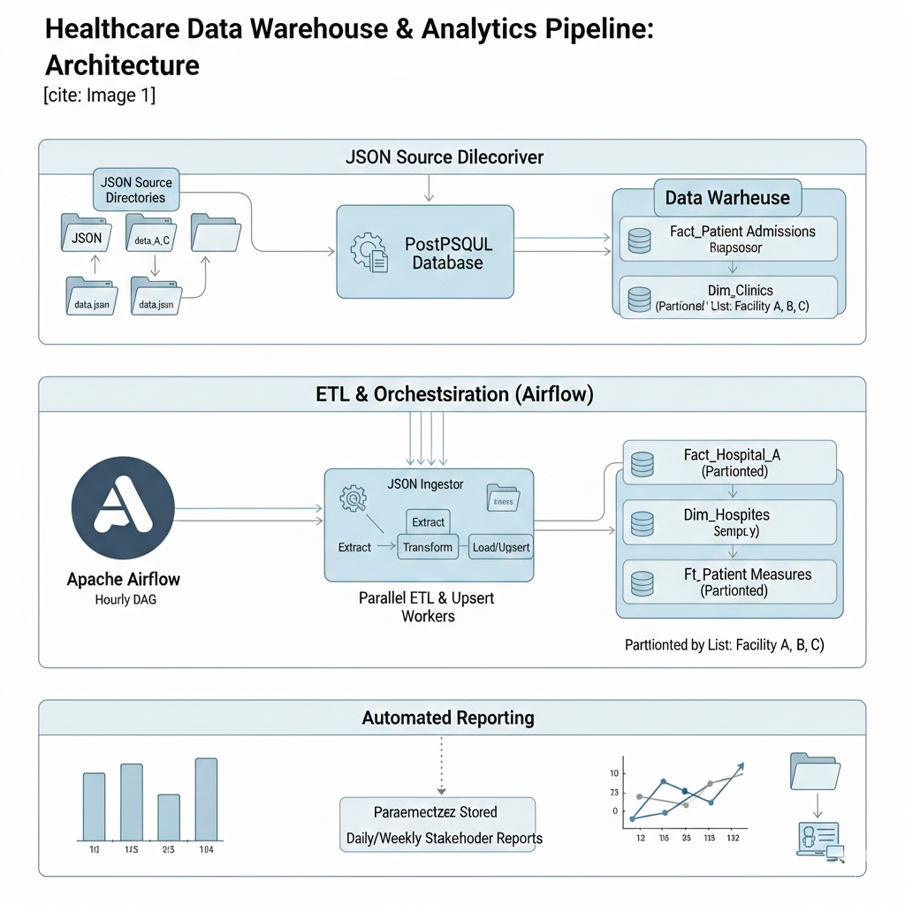

# Airflow ETL/ELT DAGs



## Overview
This project automates high-volume data movement between production staging (Postgres) and the Data Warehouse (ODS). It focuses on idempotent ETL processes, utilizing Python-based multithreading to reduce latency and ensuring strict PII masking during the transfer protocol.

# Table of Contents
- [Introduction](#introduction)
- [Installation](#installation)
- [Database Credentials](#configuration)
- [Launch-Airflow-Web-UI](#testting)


## Introduction <a name="introduction"></a>
#### This following are Airflow DAGs and there respective functions
- Orchestrated ETL (Airflow): A robust DAG (Directed Acyclic Graph) structure manages the hourly batch windows, ensuring tasks execute in the correct order with built-in retry logic and monitoring.
- Cross-Server Data Synchronization: Extracted records from the FileServer (PostgreSQL) are transformed and upserted into the Data Warehouse. This ensures patient records are updated if they exist or inserted if they are new, maintaining a single source of truth.
- Concurrent Partitioned Processing: To maximize throughput, the pipeline performs concurrent upserts across warehouse tables. These tables utilize List Partitioning by facility ID, allowing for high-speed writes and isolated data management.
- Automated Stakeholder Reporting: Post-persistence, the system triggers Parameterized Stored Procedures. These procedures aggregate data from the partitioned tables to generate periodic reports for clinical and administrative decision-making.


## Installation <a name="installation"></a>

Clone the repository to your local machine:
``` 
git clone https://github.com/Data-Fi-Nigeria-LAMISPlus/lamisplus__sync_ods_pipelines.git
```

Navigate to the project directory:
``` 
cd lamisplus_sync_ods_pipeline
```

Kindly refer to the Airflow Installation Guide provided in the repository
- Install and get Airflow up and running

## Database_Credentials <a name="Database_Credentials"></a>
- Create database file '/home/lamisplus/database_credentials/config.ini'

## Launch-Airflow-Web-UI <a name="Launch Airflow Web UI"></a>

- Navigate to your browser and launch http://public-IP:port
- Login with Airflow credentials set during Airflow installation

## License <a name="license"></a>
- MIT License

## Authors & Acknowledgements <a name="authors_and_acknowledgments"></a>
- [Uche Nnodim](https://github.com/Arshavin023)
- [Emmanuel Nnajiofor](https://github.com/emmannajichi)
- [ChukwuEmeka Ilozie](https://github.com/Asquarep)
- [Peter Abiodun](https://github.com/drjavanew)
- [Barnabas Tyav](https://github.com/tyavbarnabas)
