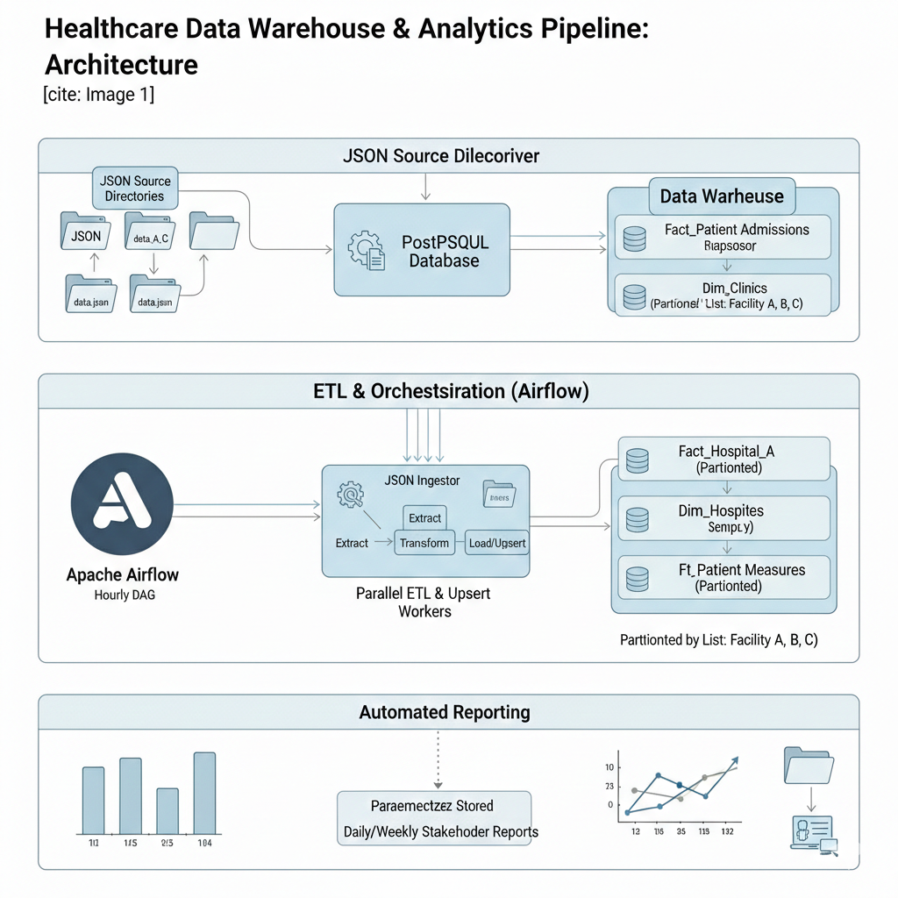

# Parallel Report Processing Pipeline



## Overview

This project automates high-volume, idempotent data movement between a production PostgreSQL staging environment and a partitioned Operational Data Store (ODS) Data Warehouse. It leverages Apache Airflow for orchestration and Python multithreading for concurrent upserts, while enforcing strict PII masking throughout the transfer protocol. Post-persistence, report generation functions are triggered automatically to produce clinical and administrative outputs for implementing partners across all PEPFAR program areas.

#### Key Components

- **Orchestrated ETL via Airflow DAGs:** Directed Acyclic Graphs manage batch windows with configurable schedules, enforcing correct task execution order with built-in retry logic and monitoring via the Airflow Web UI.
- **Cross-Server Data Synchronization:** Patient records extracted from the staging FileServer (PostgreSQL) are transformed and upserted into the ODS Data Warehouse — inserting new records and updating existing ones to maintain a single source of truth.
- **Concurrent Partitioned Processing:** Python multithreading drives parallel upserts across ODS tables partitioned by facility ID (List Partitioning), maximizing write throughput while keeping facility data logically isolated.
- **PII Masking Layer:** Sensitive patient identifiers are masked during the staging-to-warehouse transfer in compliance with data governance requirements.
- **Modular Report Function Library:** Each clinical report type is encapsulated in its own Python module under `lamisplus_report_funcs/`, with versioned (`_v2`) and optimized (`_optimized`) variants enabling safe iteration without disrupting production.
- **Automated Stakeholder Reporting:** Post-persistence DAGs trigger report generation functions that aggregate warehouse data into period-specific outputs covering 11 clinical program areas.
- **Scheduler Maintenance:** A companion shell script (`periodic_scheduler_cleanup.sh`) prunes stale Airflow scheduler state to maintain DAG execution reliability over time.

## Table of Contents

- [Introduction](#introduction)
- [Prerequisites](#prerequisites)
- [Installation](#installation)
- [Configuration](#configuration)
- [Usage](#usage)
- [DAG Reference](#dag-reference)
- [Report Function Library](#report-function-library)
- [Scheduling](#scheduling)
- [License](#license)
- [Authors & Acknowledgements](#authors--acknowledgements)

## Introduction

In large-scale HIV treatment programs, clinical data flows from facility-level edge nodes through a staging layer before landing in a centralized Data Warehouse. The latency and reliability of this pipeline directly affect program visibility and PEPFAR reporting timelines.

This system addresses that by combining Apache Airflow's orchestration capabilities with Python's concurrent processing model. Each DAG run processes a batch window, upserts records across partitioned warehouse tables in parallel, masks PII at the point of transfer, and triggers modular report generation functions — reducing end-to-end processing time while maintaining data integrity across ~599 facilities partitioned by `ods_datim_id`.

## Prerequisites

Before setting up the pipeline, ensure the following are available:

- **Orchestration:** Apache Airflow 2.x installed and configured (see `airflow_installation_guide.txt`)
- **Runtime:** Python 3.9+ with `pip` installed
- **Database:** PostgreSQL 14+ for both the staging source and ODS Data Warehouse
- **Credentials:** A `config.ini` file at `/home/lamisplus/database_credentials/config.ini` with connection details for all relevant databases
- **Permissions:** Read access on the staging database; read/write access on the ODS warehouse; execute permission on all reporting stored procedures

## Installation

Clone the repository:

```bash
git clone https://github.com/Arshavin023/parallel_report_processing.git
cd parallel_report_processing
```

Install Python dependencies:

```bash
pip install -r requirements.txt
```

Follow the Airflow setup guide included in the repository:

```bash
cat airflow_installation_guide.txt
```

Copy DAGs to your Airflow DAGs folder:

```bash
cp -r dags/* $AIRFLOW_HOME/dags/
```

## Configuration

Create the database credentials file:

```bash
mkdir -p /home/lamisplus/database_credentials
nano /home/lamisplus/database_credentials/config.ini
```

```ini
[staging_db]
host=localhost
port=6432
user=lamisplus_etl
password=your_password
dbname=lamisplus_staging_dwh

[warehouse_db]
host=localhost
port=6432
user=lamisplus_etl
password=your_password
dbname=lamisplus_ods_dwh
```

Copy the Airflow configuration:

```bash
cp airflow.cfg $AIRFLOW_HOME/airflow.cfg
```

## Usage

Start the Airflow scheduler and web server:

```bash
airflow scheduler &
airflow webserver --port 8080
```

Access the Web UI in your browser:

Log in with the credentials set during Airflow installation. Enable and trigger DAGs from the UI, or via CLI:

```bash
# Trigger a DAG manually
airflow dags trigger lamisplus_load_stg_to_ods_20260613

# Trigger a report generation DAG for a specific period
airflow dags trigger generate_periodic_reports_v3
```

Run the scheduler cleanup script to prevent stale state accumulation:

```bash
bash periodic_scheduler_cleanup.sh
```

## DAG Reference

All top-level DAG files are in `dags/`. Each DAG handles a distinct stage of the ETL or report generation workflow:

| DAG File | Function |
|---|---|
| `lamisplus_load_stg_to_ods_20260613.py` | Primary production STG → ODS sync DAG; concurrent upsert of patient records into partitioned ODS tables |
| `lamis_load_stg_to_ods_biometric_and_template.py` | Syncs biometric enrollment and template data from staging to ODS |
| `lamis_load_stg_to_ods_biometric.py` | Standalone biometric upsert pipeline |
| `lamis_load_stg_to_ods_prep_clinic.py` | Syncs PrEP clinic encounter data from staging to ODS |
| `generate_periodic_reports.py` | First-generation periodic report trigger DAG |
| `generate_periodic_reports_v2.py` | Optimized report trigger with improved concurrency and error handling |
| `generate_periodic_reports_v3.py` | Current production report trigger DAG; orchestrates all 11 clinical report modules |
| `lamisplus_refresh_reports_v2.py` | Refresh DAG for regenerating reports on-demand without a full ETL run |
| `stream_layer3_reports.py` | Streams Layer 3 (aggregated/derived) report outputs to downstream consumers |
| `airflow_api.py` | Utility DAG exposing internal Airflow API triggers for programmatic DAG management |

## Report Function Library

Modular report generation functions live under `dags/lamisplus_report_funcs/`. Each clinical domain has its own subdirectory with a base implementation, an optimized variant, and in some cases versioned iterations. The `database_connection/` package provides shared connection pooling and configuration used across all modules.

| Module | Report | Variants |
|---|---|---|
| `radet_report/` | RADET — Routine ART Data for Evaluation & Tracking | `radet.py`, `radet_optimized.py`, `pre_prepre.py`, `pre_prepre_v2.py` |
| `hts_report/` | HIV Testing Services | `hts.py`, `hts_optimized.py` |
| `pmtcthts_report/` | PMTCT-HTS — Prevention of Mother-to-Child Transmission testing | `pmtcthts.py`, `pmtcthts_optimized.py` |
| `eac_report/` | Enhanced Adherence Counselling | `eac.py`, `eac_optimized.py`, `eac_v2.py` |
| `tb_report/` | TB Screening, Diagnosis & Treatment | `tb.py`, `tb_optimized.py`, `tb_v2.py` |
| `ahd_report/` | Advanced HIV Disease | `ahd_v2.py`, `ahd_optimized.py` |
| `prep_report/` | Pre-Exposure Prophylaxis | `prep_v2.py`, `prep_optimized.py` |
| `preplongitudinal_report/` | PrEP Longitudinal Follow-up | `preplongitudinal.py`, `preplongitudinal_optimized.py` |
| `maternalcohort_report/` | Maternal HIV Outcomes Cohort | `maternalcohort.py`, `maternalcohort_optimized.py`, `maternalcohort_old.py` |
| `biometric_report/` | Biometric Enrollment & Recapture | `biometric.py`, `biometric_optimized.py` |
| `familypartnerindex_report/` | Family & Partner Index Testing | `familypartnerindex.py`, `familypartnerindex_optimized.py` |
| `database_connection/` | Shared DB config, connection, and pooling utilities | `db_config.py`, `db_connect.py`, `db_connect_v2.py`, `db_pool.py` |

### STG → ODS Sync Modules

The `lamisplus_funcs/` package contains the core staging-to-ODS upsert logic called by the sync DAGs:

| Module | Function |
|---|---|
| `stg_to_ods_20260613.py` | Current production upsert logic with context-managed connections |
| `stg_to_ods.py` | Base upsert implementation |
| `airflow_api.py` | Internal API utility functions shared across DAGs |

## Scheduling

DAG schedules are defined within each DAG file. A typical production cadence:

To schedule the cleanup script via system cron:

```bash
crontab -e

# Run Airflow scheduler cleanup daily at 3:00 AM
0 3 * * * bash /home/lamisplus/airflow/periodic_scheduler_cleanup.sh >> /var/log/airflow_cleanup.log 2>&1
```

## License

MIT License

## Authors & Acknowledgements

- [Uche Nnodim](https://github.com/Arshavin023)
- [Emmanuel Nnajiofor](https://github.com/emmannajichi)
- [ChukwuEmeka Ilozie](https://github.com/Asquarep)
- [Peter Abiodun](https://github.com/drjavanew)
- [Barnabas Tyav](https://github.com/tyavbarnabas)
